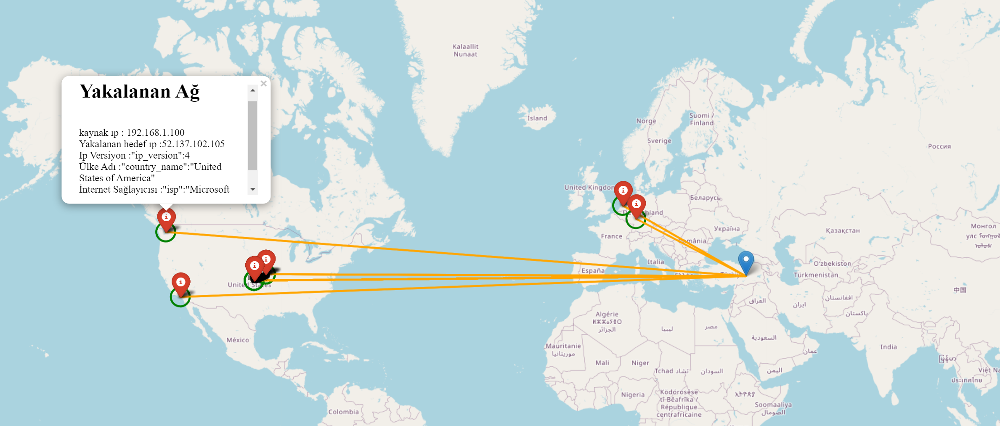

# Ağ Trafik Analizi ve Görselleştirme

Bu proje, ağ trafiğini analiz etmek ve Python ile Google Maps üzerinde simülasyon halinde görselleştirmek amacıyla geliştirilmiştir.

## Amaç

Projemizin temel amacı, Wireshark kullanarak ağa giren ve çıkan trafiği izlemek ve bu verileri coğrafi konumlara dönüştürerek dünya haritasında görselleştirmektir. Bu sayede cihazlarımıza giren ve çıkan verilerin hangi bölgelerden geldiğini anlamamızı ve ağımıza olası kötü niyetli saldırıları tespit etmemizi sağlar.

Bu görselleştirme sürecinde, cihazların IP adresleri kullanılmıştır. IP adresleri, cihazların internete bağlanması için kullanılır ve bu proje sayesinde bu IP adreslerinin coğrafi konumları harita üzerinde görüntülenir.

Projemizin kullanım alanları şunlardır:
- Siber saldırıların tespiti
- Ağ performansının analizi
- Ağ yapısının ve veri alışverişinin anlaşılması
- Güvenlik ve eğitim amaçlı kullanım

## Nasıl Çalışır?

Projenin geliştirme aşamaları adım adım şu şekildedir:

### Adım 1: Ağ Trafiğini Elde Etme

Wireshark kullanılarak ağ trafiği yakalanır ve bu trafiği pcap dosyaları olarak kaydedilir. Wireshark'ta bir arayüz seçilerek ağ trafiği izlenmeye başlanır.

### Adım 2: Verileri Dışarı Aktarma

Yakalanan ağ trafiği durdurulur ve pcap dosyası olarak dışarı aktarılır. Bu dosya daha sonra kullanılacak Python betiği içine alınır.

### Adım 3: Veri Seti Seçme

Dışarı aktarılan pcap dosyasındaki verilerin coğrafi verilere dönüştürülmesi için gerekli olan veri seti seçilir. IP adresleri coğrafi koordinatlara dönüştürülür.

### Adım 4: IP Bilgilerini Alma

Pcap dosyasındaki IP bilgileri, soket kütüphanesi kullanılarak çıkartılır.

### Adım 5: Coğrafi Koordinatlara Dönüştürme

IP bilgileri döngüye sokularak coğrafi enlem ve boylam bilgilerine dönüştürülür.

### Adım 6: Görselleştirme Yapmak

Ağ trafiği, folium kütüphanesi ve Google Haritaları kullanılarak görselleştirilir.

## Nasıl Başlatılır?

1. Gerekli kütüphaneleri yükleyin:

2. Projenin ana betiği olan `main.py` dosyasını çalıştırın.

## Kullanılan Teknolojiler

- Python programlama dili
- Wireshark
- Folium kütüphanesi
- Google Maps API

## Uygulamaya Ait Görüntüler

